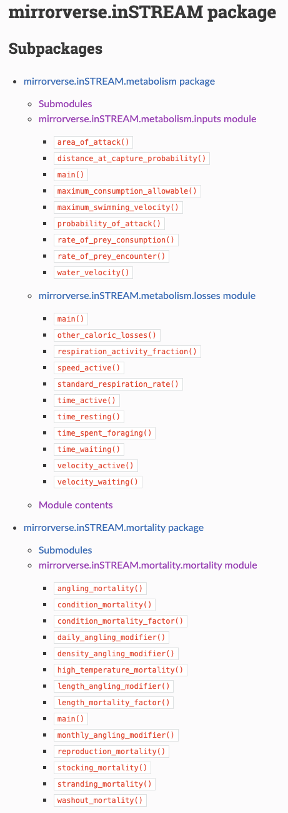
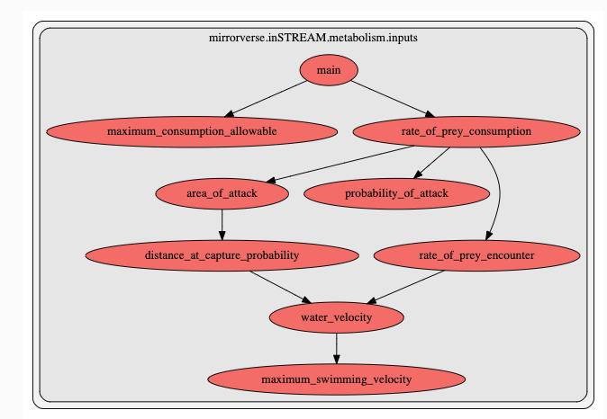
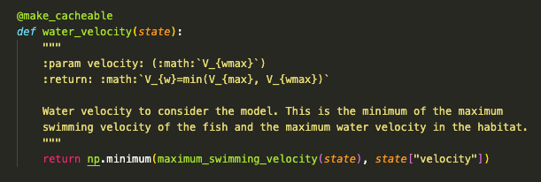
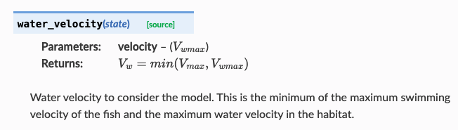
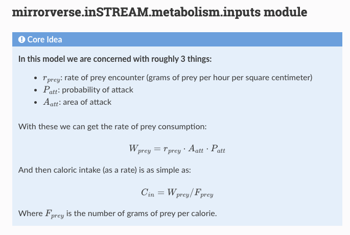
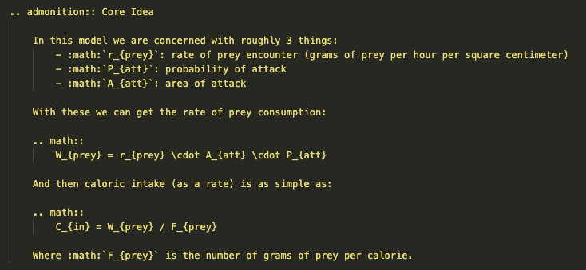

# January 30, 2024

## Automated Documentation

One of the specific weaknesses of IBMs that I wanted to start addressing was their opacity. To help with this I've come up with the following to date:

### 1. Documentation as Code
Often times documentation and the code are separated. This is problematic for several reasons. (a) the documentation and code often get disconnected or out of date (b) its hard to see the big picture in the code (c) its hard to see specifics in the documentation (d) keeping documentation up to date is pretty laborious. So I'm using [`sphinx`](https://www.sphinx-doc.org/en/master/) to make sure the code *is* the documentation. 

### 2. Clear Model Hierarchy
These models have *a lot* going on. Therefore trying to drink it all in is like trying to drink from a fire hose. The way to deal with this is to take advantage of our hierarchical minds. So I'm aiming to divide the models into some distinct levels. 

Now animals are generally interested in three things:

1. Not dying
2. Growing
3. Reproducing

To acheive these aims our creatures take actions. Therefore we are interrested in modeling:

1. Mortality
2. Growth (Metabolism)
3. Reproduction
4. Actions
5. Choice

This is the top level of our hierarchy. 

For each of these we're going to have two aspects - actual and perceptual. Basically while there are specific mechanisms governing, say, mortality our animals are rarely aware of all the physics going on. So we'll have a "real" model or mortality and then a "perceptual" model of mortality. This represents the second level in our hierarchy. 

> We'll represent the first two levels in our hierarchy as sub-packages in our model. I.e. we'll have our top level model package (say inSTREAM) and then subpackages like the following `inSTREAM.metabolism`, `inSTREAM.metabolism_perceived`, `inSTREAM.mortality`, etc. This will mean that `sphinx` will organize our documentation according to our hierarchy.

Within each of these groupings we want to divide things up into clear components (which will end up as sub-packages or modules of their own). So for example we will have `inputs` and `losses` for metabolism which will have very clear units (C per day for example). That way we have one clear interface with the `metabolism` componenets. 

This results in something like the following:

Alright now suppose that we're dealing with the `metabolism.inputs` module. Even within such a module it can be difficult to keep everything straight. For example in the `inSTREAM` model there are 8 different functions and ~15 inputs. 

For functional dependency I propose the following:

- All functions take a single `state` as their input which will end up with the full state required for `metabolism.inputs`. 
- All functions have a `@make_cacheable` decorator which basically caches the output of the function in the `state` and returns the cached state instead of executing the function if the output is in `state` already. The advantage of this is that we can call function directly all over the place but know that they'll only be evaluated once. 
- Each time we need something like `rate_of_prey_encounter` instead of pulling it from `state` we just call the `rate_of_prey_encounter(state)` function again (this makes it explicit for automatic dependency graph builders)
- Have a `main` function per module that creates the module outputs (C per day for `metabolism.inputs`)
- Use `pyan3` and the `pyan.sphinx` extension to automatically build a dependency graph of `main` so we can see how all the functions relate to one another in a dependency graph.

This results in something like the following in the module documentation:

Finally while we now know which functions are required in in what order there's still the question of what needs to go into these functions. This is now quite easy. Whatever we need to pull straight from `state` become the inputs and we can just incoporate them into the code doc strings like the following:

Which gives us:

This is also nice because we can include mathematical notation to help make the exposition clearer and more precise. Finally you'll see there's the source button which will take you to the code if needs be. 

### 3. Building Intuition

Dependency graphs, hierarchies, mathematical notation, and quick access to the code is nice but sometimes one just needs a "human" explanation of what's going on. Well `sphinx` gives us `admonitions` which allow us to put "slides" on the documentation as well. So I'd like to have "Core Idea"s at the top of each module's documentation. For example:

is the result of this code in the docstring at the top of the module:

## How to Get this Documentation?

Well assuming you've followed the rules above there's a `make_docs.sh` script I've written that will use `sphinx` to build the docs for you. So it's a single call :) 

## Reproducing inSTREAM

The code I have thus far can be found here: [inSTREAM repro](https://github.com/networkearth/mirrorverse/tree/ce6c458ec95b79485baa4dc3b2723ee166336ba8/mirrorverse/inSTREAM)

1. I got most things in place for metabolism and mortality (although there are several submodules they reference from other papers that I'd need to pull in)
2. Used this to test out my auto-documentation techniques that I outlined above. 
3. Made good progress understanding the rest of the model (in preparation to implementation)

However a few things have jumped out to me as I've been digging into the model more. 

### 1. Suspicious Calibration...

As I started realizing just how many parameters go into this model (105 in total) I became more concerned about how they fit this thing. Turns out they were looking at 9 years of data, two species, and then five metrics per species (3 groupings of length at age and 2 groupings of total count). That means they had 90 data points they were trying to fit. Now to be fair many of the 105 parameters are fit using data from other papers (as they are things like strike distance vs length models) but even if you assume there are only 25 parameters that's still very few data points per parameter. 

Furthermore I realized that they only tuned against the 9 in one "fold". The normal procedure to prevent overfitting is to fit against more than one "fold" (i.e. sub sample your data several times and train and validate across those many subsets to prevent overfitting). Given they didn't do this I'm worried their model is probably quite overfit. 

Then I realized that the charts in the paper showing their "results" are actually against their training data!!!! And it's not a great fit... 

So the fitting paradigm is not one I'd use and I'd likely either want to reduce the number of parameters or increase the number of metrics to further prevent overfitting.

### 2. Unreal Possible Outcomes

So one odd thing is that the fish in the simulation don't actually compete for food - they compete for space. Yet that competition is not completely exclusive. Instead, if a habitat unit has run out of space the trout left over are set as "movers" which more or less means they expend more energy to get less food. But once the designation of "mover" has been made how much food they receive is *completely independent* of the density of fish in the area. This means that theoretically the simulation could create scenarios where there are enough trout that more calories are consumed than actually exist. This is "prevented" in what seems to be three ways:

1. Fishing pressure increases with density
2. They have a parameter $f_{eat}$ they calibrate that can reduce (as much as they like) the amount of food movers get as compared to "stayers"
3. Fish move based on how much weight they are gaining so a fish that starts gaining less weight will likely move. 

However (1) and (3) don't actually control this directly at all and if either the fishing pressure is low enough and/or the fish have no "memory" of being stayers, (1) and (3) will exert no control at all. So the only real prevention against this "infinite fish" situation is $f_{eat}$ which, as I said before, is a free parameter they tune (i.e. it's not based on any known science). 

There are one or two other "unreal feeling" aspects to the model, but this one is enough to scare me quite a bit.

### 3. Overcomplications

There are 105 parameters in this model and they're using it to predict overall abunance and average weight vs length per age group... I have absolutely no idea if all 105 parameters are needed and, as I mentioned in (1), the fit isn't even that good. Furthermore I'm worried this is overfit (see above) so I don't know if this can be reliably used to predict forward in time. They make mention that it follows "general patterns" but that's not good enough in my book... I want to see the model against testing data. 

What I think would be useful to see is how little one needs to include to get results like they are getting. 

### 4. Tackling too Many Problems

Finally I think it would make sense to split the model into:

- habitat distribution
- reproduction

One could solve the first problem first and then move onto the latter. I understand why they want both in the end, but it would be so much easier to understand if one focused on how the model works within the year and then moved from there to dealing with multi-year dynamics. 

## Next Steps

Given my uncertainties around the inSTREAM model I'm going to take a slightly different tack. Rather than trying to replicate their model exactly I'm going to start with a really dumb model and work my way up. I want to understand how much complexity is actually required and right now I've got no idea. Furthermore I'd like to use more rigorous ways of fitting the model and without a comparison to work against I'll need to start simple and work my way up if I have any hope of debugging things along the way. 

So goals under the pivot:

1. Find their data and get access
2. Make a dumb IBM and see how well it does with more rigorous calibration
3. Move forward given what I learn from (2)

