# February 16, 2024

## Warehousing

Last week I rambled on about warehouses. This week I played around with what one would look like. Specifically I read a decent component of [The Data Warehouse Toolkit](https://www.amazon.com/dp/1118530802?psc=1&ref=ppx_yo2ov_dt_b_product_details) and then played around with a few different technologies. As my example data I went ahead and used the trawl data from the [AFSC Groundfish Assessment Program](https://www.fisheries.noaa.gov/foss/f?p=215%3A28). 

I was pursuing several different goals.

1. Discoverable: If I can't find data, the data might as well not exist. Therefore I need to be able to use simple search terms and procedures to find my data and be able to do so without knowing niche kinds of knowledge. The more some ordinary schmoe could find the data, the more discoverable the data is becoming. 
2. Explorable: Suppose I find a database labeled "trawl" data. Is this the data I want? Perhaps, but I'm certainly going to have more requirements than just that the data was collected using a trawl... I'll probably want to know what years, places, and species are included at the very least. Therefore I need simple, reusable ways of being able to see the shape and form of the data and filter it down before I ingest that data. In theory if a warehouse is supposed to contain *all* of the data of a specific form, I definitely don't want to be downloading the whole dataset at any time and therefore need easy ways of filtering and exploring the data without having to deploy specialized tools beyond those provided by the warehouse. 
3. Comprehensive: I shouldn't have to pull down 100 different trawl datasets either. I should be able to get all (or nearly) all of my trawl data in one standardized form. Otherwise both searching for data, and the joining data is going to become a nightmare because all of the standardization will be up to me as the user, when clearly this should be provided by the warehouse. 
4. Standardized: If I'm going around searching for trawl data and then also want to grab temperature data or depth data the filtering I'm using on each of these tables should be standardized. I shouldn't have to learn how to filter by date in one table, and then learn a completely different method for filtering by dates in another - a date is a date! 
5. Directly Accessible: Once I know what I want I should be able to just download it. Simple enough requirement but often lacking. 
6. Joinable: One kind of data alone is usually pretty useless. It's when we join different kinds of things that we start to find useful patterns. Therefore I need a way to see that the different kinds of data I'm pulling down are in fact going to line up nicely. 
7. Atomic: Summary data always blocks new kinds of rollups and investigations. So just store the atomic data already! 
8. Contextual: The data should come with as much context as possible. For example if we're dealing with trawl data I want to know the ship, the day, the time, the study, who was in charge, and so on. 
9. Scalable: All of this shouldn't fall over the moment we are successful and the data really starts pouring in. 

To acheive this I wanted to use as much prior technology and insight as possible (i.e. not reinvent the wheel) and after my searching and reading I came up with the following.

### 1. Use Dimensional Modeling

The idea behind dimensional modeling is wonderfully simple. You have two things (1) facts and (2) dimensions. Dimensions are the context, they are the things you filter on or group by. Facts are the data you're summarizing. Facts usually have extremely high cardinality and therefore tables that include both them and their context become unscalable quickly. Dimensions are usually low cardinality and so you can include as much context in tables that have them as you like. So what you do is you have your fact tables simply link out using integer (small) keys to your dimensions that way you can store as much human readable format in your dimension tables as you like while leaving your fact tables lean, huge, and scalable. 

As an example here's the Entity Relationship Diagram (ERD) for some trawl data I pulled down:

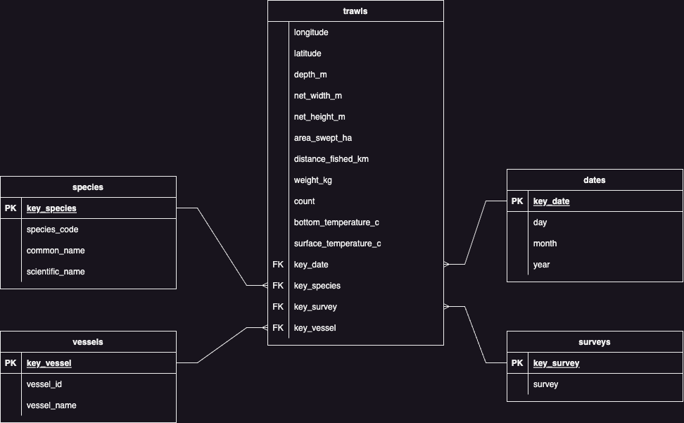

In this example the `trawls` table is the fact table with all others being dimension tables. What's nice about this is all of the data in the fact table can be floats and ints (which are really easy to store) whereas our context can be very human readable. Furthmore you can imagine reusing the dimension tables to provide context for a whole slew of other fact tables. For example you could easily reuse `dates` and `species` for tagging data allowing for one common set of filters across the board.

Furthermore one could easily go ahead and add a `weekday` or `holiday` field into the `dates` table and it would require a huge update of the very large `trawls` table.

Dimensional modeling is pretty sweet!

### 2. Metabase

With the database sorted (I ended up using `postgis` for now) it was a question of how to make the data discoverable. Obviously one could go in and use SQL to query around but that's pretty technical and therefore defeats the requirement for easy search. 

I looked through and tried out a few different open source business intelligence tools and ended up finding metabase to be the best. To see why let's take a quick tour. (We'll use an instance of metabase that I connected to the data structure outlined above)

First metabase makes it really easy to find what databases you have access to. Going to their "Browse Data" page gives you this:

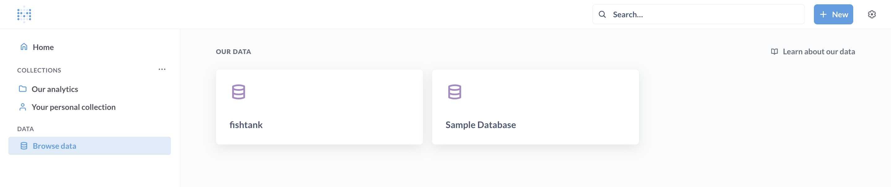

We can see that in our case we have a sample database (preloaded by metabase) and `fishtank` which is our `postgis` database. Clicking on `fishtank` we come to:

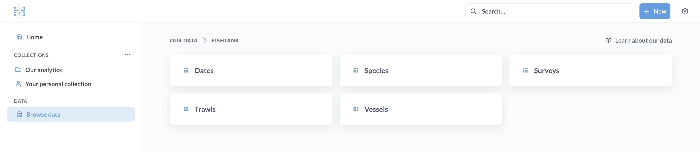

And so right away it's super easy to see what kinds of info we have access to! (Note that metabase discovered all of this for us by sweeping through the `postgis` database automagically)

Let's click on `Trawls`.

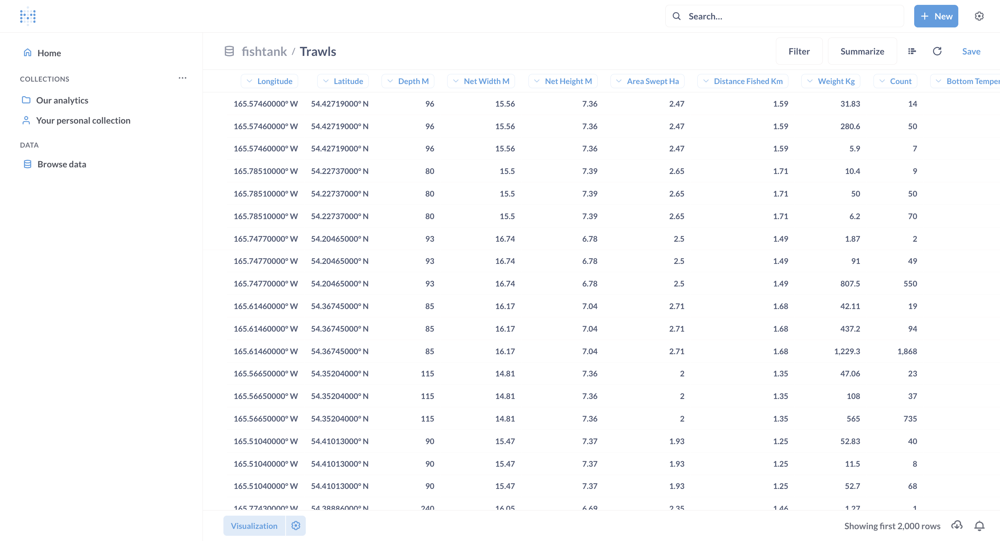

There are a couple of things to note here:
1. We can quickly see all of the columns we have available and if you click on them they'll drop down the ability to filter on those columns.
2. In the bottom right corner is a download button, so once we have the data we like, we can go ahead and grab the data. 
3. At the bottom left is a visualize button, this will allow you to create plots of the data to help you explore it. 
4. In the top right there's a symbol that looks like three lines stacked - that's going to take us to more advanced filtering and joining. 

Let's start by looking at the joining piece in (4).

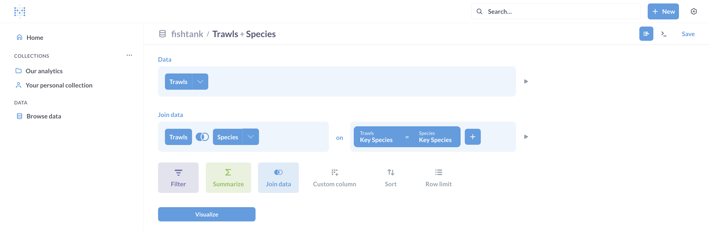

Here I've gone ahead and added a join. Note the process was simply point and click with drop downs helping me the whole way. With this join we'll be able to add species into our raw form data and then filter on it. 

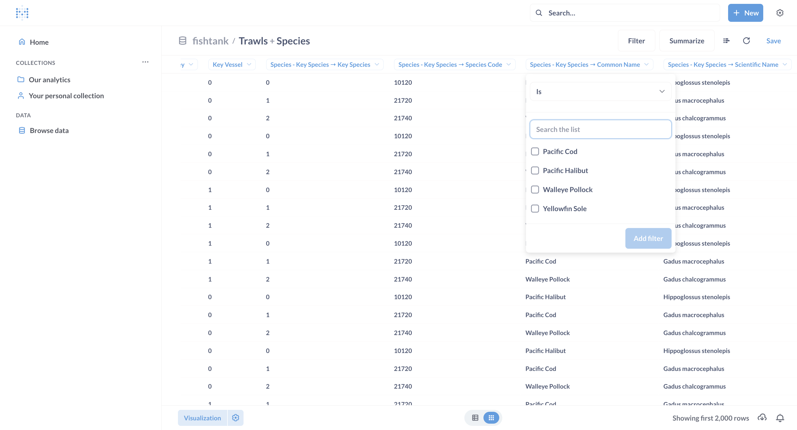

We can see that some species context information has been added and by clicking on the `Common Name` column and requesting to filter I've now got check boxes that will allow me to choose the species I want in my data. 

Let's pick walleye and finish off by looking at one or two visualizations.

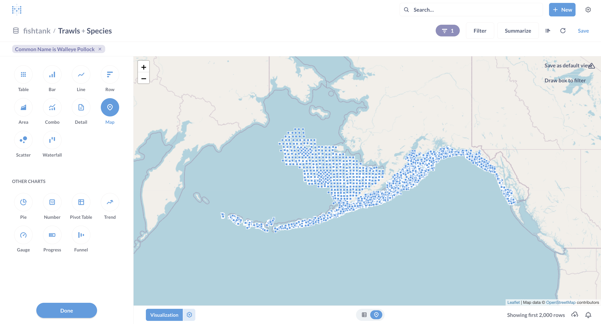

So with literally two clicks I have a map of where all my observations were taken... pretty crazy how easy that was. 

If I hit the `Scatter` button instead and then pick that I want to scatter `Count` vs `Net Width M` I get the following:

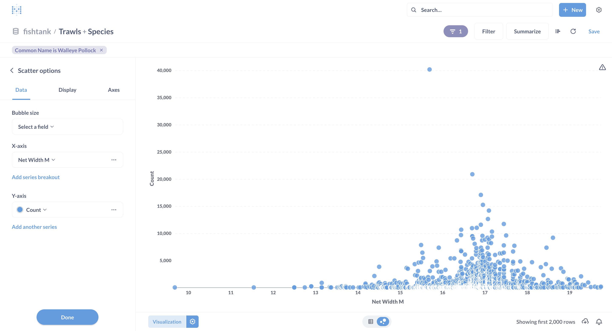

Seems a bigger net doesn't always mean more fish. 

Now see that `Save` button in the top right? That's right you can save and then share by link any visualizations or dashboards you create! Which means you can also build consolidated views that people can use to explore the data. Pretty awesome!

All this is great but metabase does have one significant weakness, their spatial plotting is pretty weak. So let's bring in another tool!

### Kepler.Gl

So let's go ahead and download our walleye data. Now let's open up `kepler.gl`.

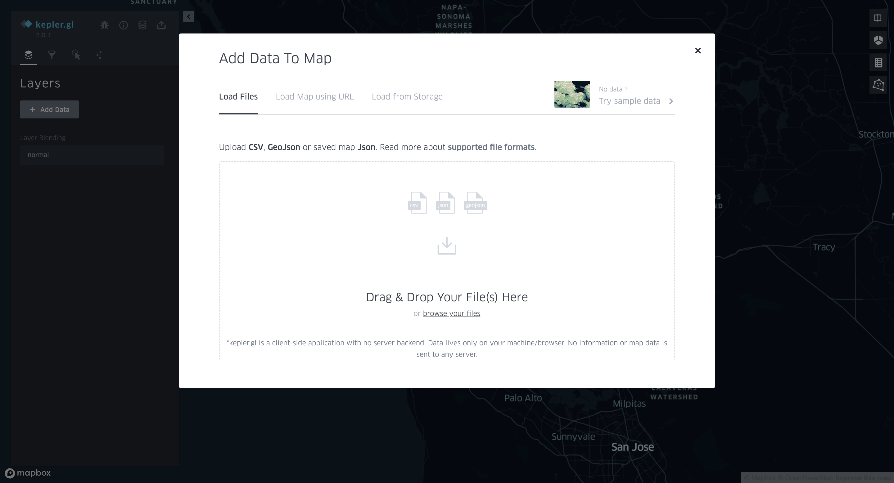

Note that this is allowing us to pull in data from pretty much anywhere. So if you have some other data you want to take a look at, this is a sweet tool.

Anyways let's upload the data we just downloaded from metabase.

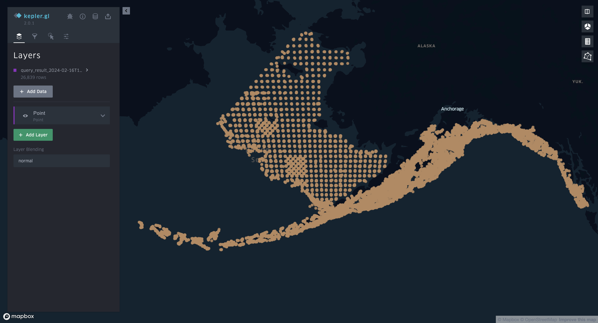

Alright so far this just looks like what we had in metabase. But if we click `Point` we're going to get a whole slew of visualization options. 

As a simple (but powerful) example we can get a drop down of all the fields we could color our points by.

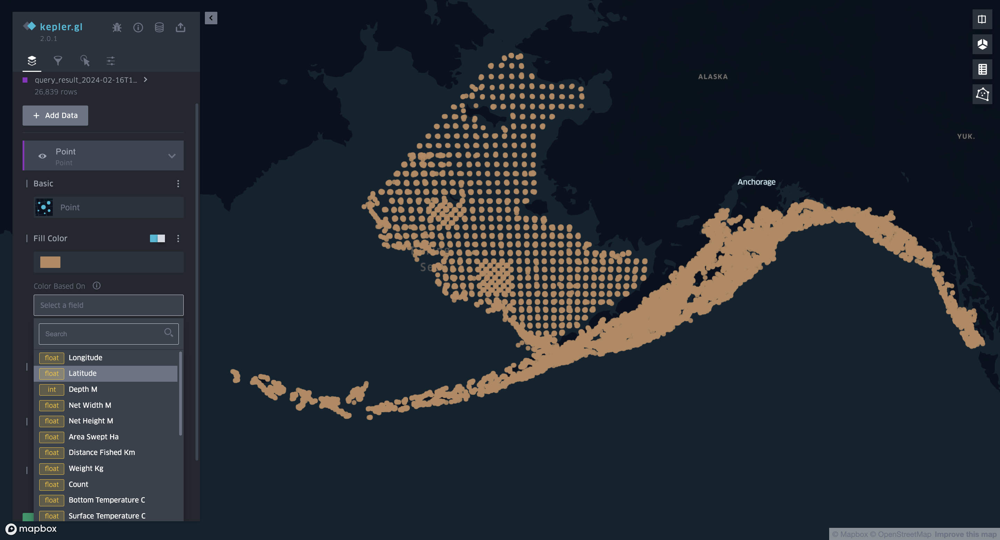

Let's go ahead and look at bottom temps. 

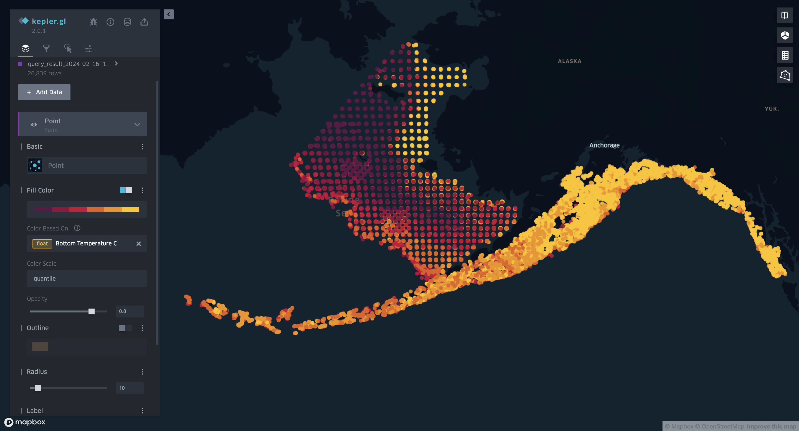

How does this compare to counts? 

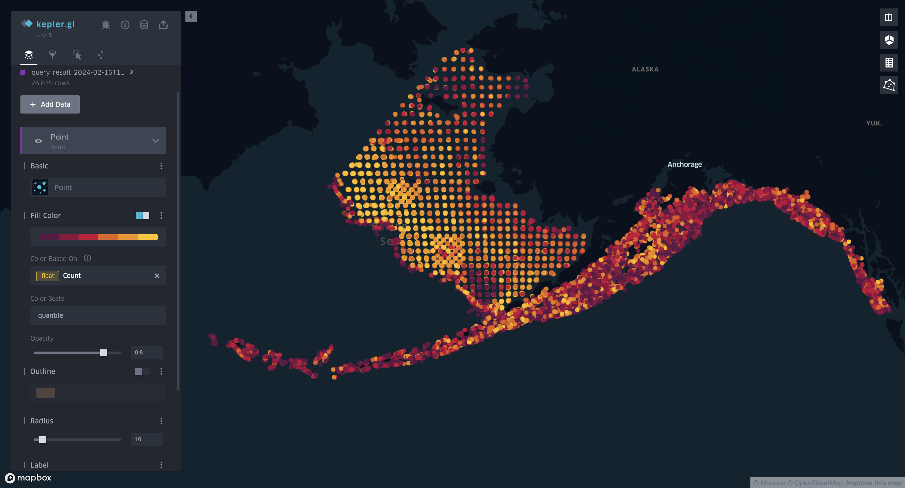

Pretty interesting!

Obviously this is only scratching the surface of what kepler can do. And remember you can just keep making more layers out of the data you've already loaded or new data you've uploaded from other spots! So you can layer map data, do all sorts of filtering and then, guess what - kepler also allows you to redownload the filtered data. So you can refine your datasets geospatially here before actually running your own bespoke analysis. 

### A Note on Containerization

Alright so how did I get all of this up so quickly? [`Docker`](https://www.docker.com/) is the answer. Docker is a containerization technology that is used pretty much everywhere these days. What is containerization? Well it's basically like packaging an application in its own little tiny operating system in such a way that it can be run virtually on any computer that has `Docker` installed. This means that rather than having to worry about application dependencies, configuration, etc. You can just run a command like:

`docker run metabase/metabase`

and boom! metabase is up and running locally on your machine. 

`Docker` also provides a tool called [`docker compose`](https://docs.docker.com/compose/) that allows you to combine a bunch of different containers into a single network of applications with one simple script. 

So I used dockerized `postgis`, `metabase`, and `kepler` to do the above and all I needed was the following:

```yaml
services:
  postgis:
    container_name: fishtank_postgis
    image: postgis/postgis:15-master
    environment:
      POSTGRES_USER: username
      POSTGRES_PASSWORD: password
    ports:
      - 5432:5432
    volumes:
      - ~/fishtank_volumes/postgis:/var/lib/postgresql/data
  metabase:
    container_name: fishtank_metabase
    image: metabase/metabase:v0.48.6
    ports:
      - 3000:3000
  kepler.gl:
    container_name: fishtank_kepler
    image: crazycapivara/kepler.gl:latest
    ports:
      - 8080:80
    environment:
      - MapboxAccessToken=${MapboxAccessToken}
```

and then I run 

```bash
docker compose up
```

and like magic I've got a `postgis` database and `metabase` + `kepler`. 

### The Path Forward

Having a local (and easily rebootable) version of this means we can experiment around with exactly how we want our schemas to look before committing to anything. So for the time being I'm just going to stick to this local instantiation and see what works, what doesn't, and keep tweaking until I have something folks are interested in. 

In the meantime I'll also start drafting a deployment plan in the background and work on understanding how to deal with security and scale. That way once we have something useful (even if its not what I just described) we'll have a way to deploy it. One thing I want to figure out is how to allow for "down to zero" scaling on things like metabase so that on deploy it can be as cheap as is humanely possible. 

But long story short is this:

> As I get more data I'll warehouse it for myself so that whenever we end up with publishable things we can publish with a link to a warehouse where folks can retrieve the data I used (obviously excluding anything folks don't want shared).

### Where to Find the Code for the Above

[The fishtank](https://github.com/mgietzmann/fishtank)

## Next Steps

1. Folks are responding with data! So I'll be primarily digging into that stuff, learning what I can do with it, and warehousing it away for myself.
2. I want to develop that deployment plan for what I described above.
3. I've started consolidating all the ideas I've had over the past few months into a single narrative, so I'd like to get that written up as well. 

Once all the data is understood I'll get back into the IBM headspace and see what we can do with it. 

Until next time! :) 


