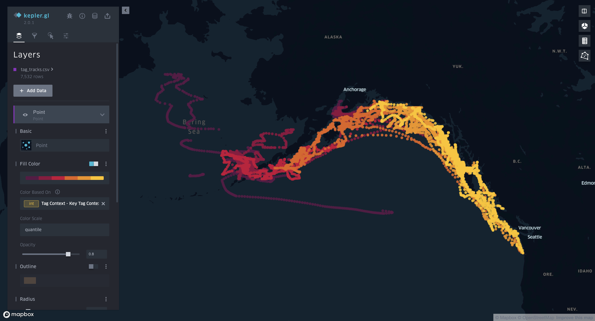
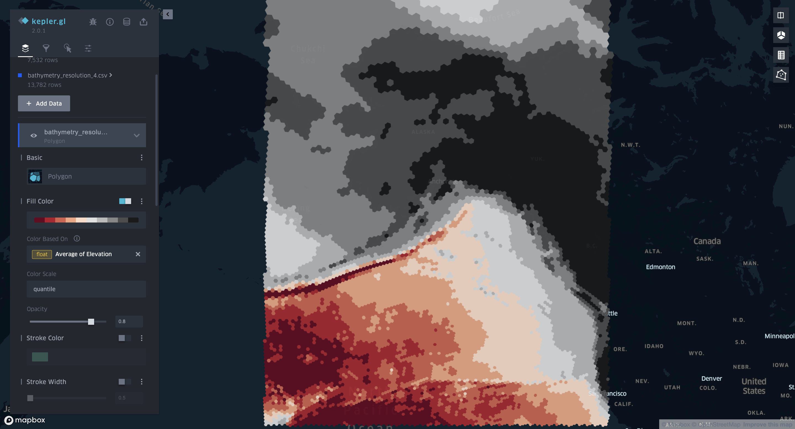
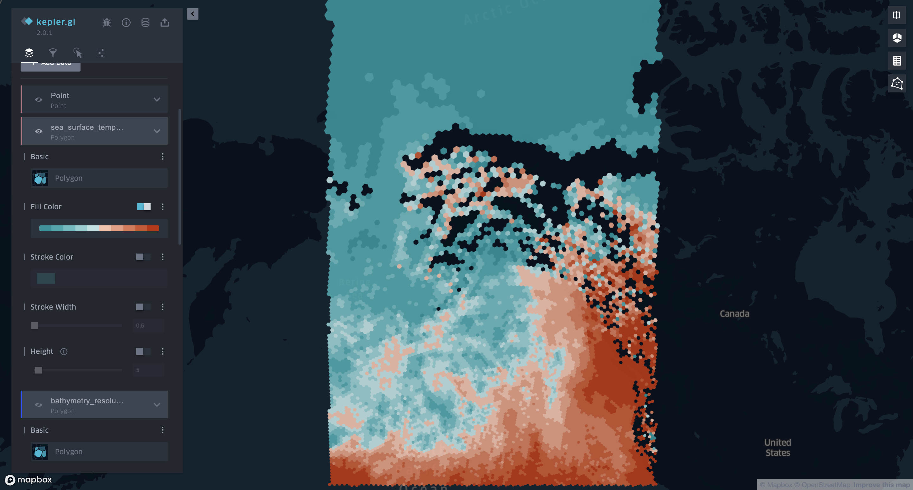
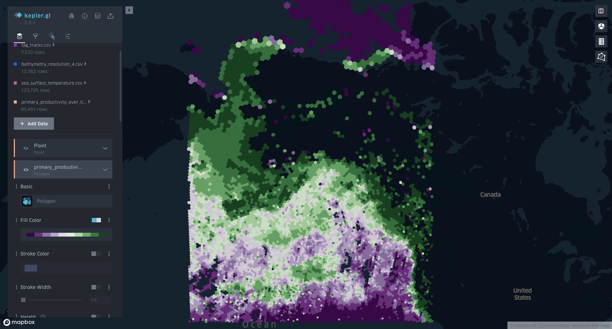

# February 25, 2024

## Gathering Data!

This week was all about pulling data together in order to start formulating some hypotheses around
building our first IBM's. As such there was a lot of data cleaning and wrangling going on. Let's 
look at some of the highlights.

### Dimensions

#### Formulaic Keys

From our prior research into dimensional analysis we know that one of the keys to making a good
warehouse is setting up good dimensions. Two in particular stood out this week - time and space.

For both of these I'd initially begun with the idea of just creating a primary key (in the normal)
style for each new row in our dates and spatial tables (more on the latter in a moment). However 
what I very quickly realized was that having to query the table every single time to determine
what new keys I was going to use when uploading my fact tables was going to get prohibitively 
expensive. Imagine if everytime you have a new dataset, you have to pull down the entire dimension
table just to get keys! Therefore I'm going to go ahead and use what I'll call "formulaic keys", 
that is keys that can be computed from the single dimension value. For example if I have the date
1970-02-01 I can create a key from its epoch (the number of seconds since 1970-01-01 00:00:00) 
which in this case would just be 2678400 (3600 seconds/hour * 24 hours/per * 31 days in Jan). This 
way when uploading fact tables I can generate the dimension keys without having to reference 
the dimensional tables at all. 

Similarly if I at some time need to drop a dimension table and rebuild it, or if the dimension table
is somehow lost or corrupted I can easily rebuild it without having to modify anything on the 
fact table side. So using these "formulaic keys" should be pretty handy. 

#### Space

In dealing with the spatial dimension I decided to go with [Uber's H3 index](https://www.uber.com/blog/h3/). I've used this a ton 
at Viasat and have absolutely loved it. It comes in loads of different resolutions from very fine
to extremely course (which is awesome for aggregation) has formulaic keys (as needed above) 
and good code libraries for messing around with spatial data. 

With this in hand we can do spatial aggregations without ever having to worry about polygons or
other shapes until we're ready to display the data. 

The way this is going to work in our data is that we'll choose a lowest resolution (I'm picking
 resolution 4 for now) and then have a more course resolution (2). We'll have our fact tables
indexed into both resolutions and that way we can group our facts by whichever resolution and
then join to the relevant rows in the appropriate dimension table (`h3_res_2` or `h3_res_4`). 

This makes querying, joining, sorting, merging, etc. super easy. Furthermore in the future we
can add things like region, bounding coordinates, and so on to our spatial dimensions. 

### Facts

A lot of the following has a lot of nitty gritty details which can be found in the [code](https://github.com/mgietzmann/fishtank). For this 
report I'm just going to highlight the main points. 

#### Tagging Data

For our tagging data I've uploaded three tables:

- tracks - these are the cleaned tracks by day
- tagging - these are the 15 minute depths and temperatures
- tag_context - this is really a dimension table (keyed by PTT) that allows us to pull in all the tag metadata

The former two tables link out to the date dimension.

As we continue pulling in tag data from other sources I'd like to standardize (as much as possible) 
what these specific tables look like, but for now I've left them relatively raw as abstracts come not
from one sample alone. 

#### Bathymetry Data

I sourced this data from - https://www.gebco.net/ 

As with the rest of the data I limited the boundaries of what I pulled to the area of Alaska in which 
the tagged fish were found. 

#### Temperature Data

I grabbed surface temperature from Google Earth Engine - https://developers.google.com/earth-engine/datasets/catalog/NOAA_CDR_SST_PATHFINDER_V53

I went ahead and took an aggregation of surface temperature per H3 res 4 cell across 6 days in the middle of each month in 2018 just to get a general set of what the temperatures look like. I'll 
obviously need to get temperatures closer to the time in question but this was more an exercise
in making sure I could grab the data and see that it actually looked reasonable. 

#### Primary Productivity - Chlorophyll A

Different data source from Earth Engine - https://developers.google.com/earth-engine/datasets/catalog/JAXA_GCOM-C_L3_OCEAN_CHLA_V2#description 

But otherwise took largely the same approach as described above for surface temps. Only difference
is that I could take a 14 day window in the middle of the month as the resolution on this data is
slightly less than temperature data (and Earth Engine has specific limits on the data you can pull
at a time).

### Other Notes

- All of this data has been uploaded into the database, metabase, and displayed in kepler successfully. 
- I'm starting to work out a general set of helper functions to make
working with dimensions and fact tables really easy. See the code for more on that. 
- All of the code to clean, normalize, enrich and upload the data can be found in [`fishtank`](https://github.com/mgietzmann/fishtank).

## Thoughts on IBMs

With all of this data in place there seem to be some reasonable clear 
patterns:

- The salmon seem to be exhibiting two "modus operandi" - foraging and migrating
- Foraging seems to be more or less a bounded random walk
- Migration seems to be a - straight as can go - leap off toward what I can only assuming is their river of birth
- Foraging seems bounded primarily by some combination of interesting bathymetry (cliffs, mountains, etc) and primary productivity. 

One thing I haven't looked at yet is to what extent temperature is
dictating anything. 

So one idea I have is to try the following:

1. Model each salmon as a ticking time bomb that will at some random point (perhaps guided by season) mature and migrate. 
2. Give each salmon a homing ground (proportions of who goes where to be
set as part of the simulation)
3. While not yet matured the fish will forage - a bounded random walk where the bounds are an affinity for some degree of primary productivity (need to think more about that one)

The patterns to fit here will be:

- Individual migrations once the homing destination is known
- Random foraging behavior

The patterns to be left free will be:

- Maturation probability
- Homing destination proportions
- Overall number of salmon

Then what I'd like to do is build a model of density by space and time
given those three free parameter sets. 

Once that's done I'll then fit the results to bycatch data/trawl data and see what the inference is in terms of number of salmon and 
distribution across homing destinations. 

But that will be hell of enough work for a little while and I'm sure
pivots will come along, so I think that's far enough in terms of
the planning for now. 

Let's start building an IBM!

## Next Steps

This week I'll be attending a Viasat workshop so I expect to get back to this at the 
beginning of March

1. We'll start by modeling single salmon to get that migration and random
walk behavior working
2. Then we'll build the appropriate infrastructure to run this for loads
and loads of salmon simultaneously.
3. We'll fit the GLM in order to be able to predict changes due to 
homing distribution and overal population size.
4. See what our trawl/bycatch data suggests when put in the context of 
this model! 

Ultimately the idea here is to use tagging data to fit
how salmon behave as individuals, tie that into how 
they'd distribute themselves given a homing destination
distribution, and then combine that with trawl data
to predict the real distribution of homing 
destinations.

We'll see how far we get! :) 

