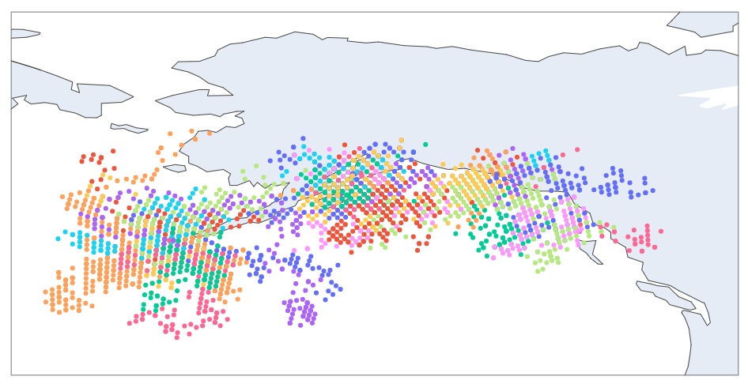

# March 11, 2024

Not a Friday but wanting to capture a milestone nonetheless. 

Last Fishy Friday we noted that we have a model capable of doing a lot better than totally random. 

Our real data looked like:

Our totally random walk:

And then our model:

So a lot better but clearly missing these longer runs (all of the movement is far too clustered). 

So I decided to chase after a model in which our fish could exhibit one of two strategies - drifting or running (clustered or along a clear heading). 

To do this required I get quite a bit more sophisticated and implement the following decision tree that the fish must evaluate at each time step:

Where each of the decision boxes now required it's own model (so we now have four models instead of just 1). 

To do this I implemented a new kind of class called a ChoiceNetwork (find out more [here](https://github.com/networkearth/mirrorverse/blob/b1c9e9e0b77b962594a552fd859c2ecbe8de7e07/ideas/chinook/choice_network.py#L82)) that allows me to keep track of everything and keep things straight. 

I then trained all four models and simulated the data again. 

Now what's interesting about this is that you can clearly see that we still have the old drift behavior from the last model, but now we have these runs jettisoning out all over the place as well.

Now one thing to understand is that these models are largely probabilistic. For example the "along what heading" model gets as input - the last heading, the immediate elevation and temperature across each new possible heading, and whether or not we were on a run in the last step. That's it, that's all it gets. And what's wild is that the especially long runs all more or less point along the same heading - south east... 

Which of course makes me wonder whether the model is just learning that for a lot of the fish tagged their home river is southeast... 

So what I'd like to do next is to work out how to figure out who's actually just on a run home to spawn so that I can add that in here as well. 

Until next time!
