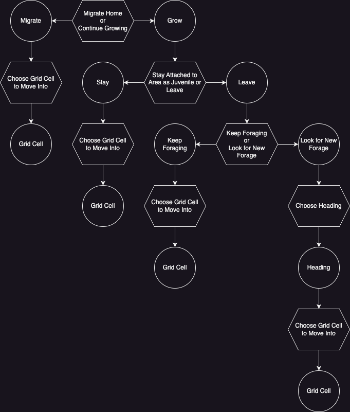
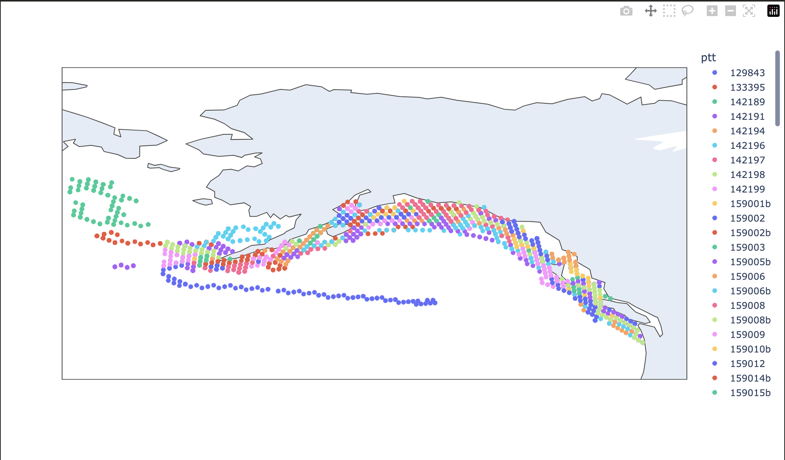
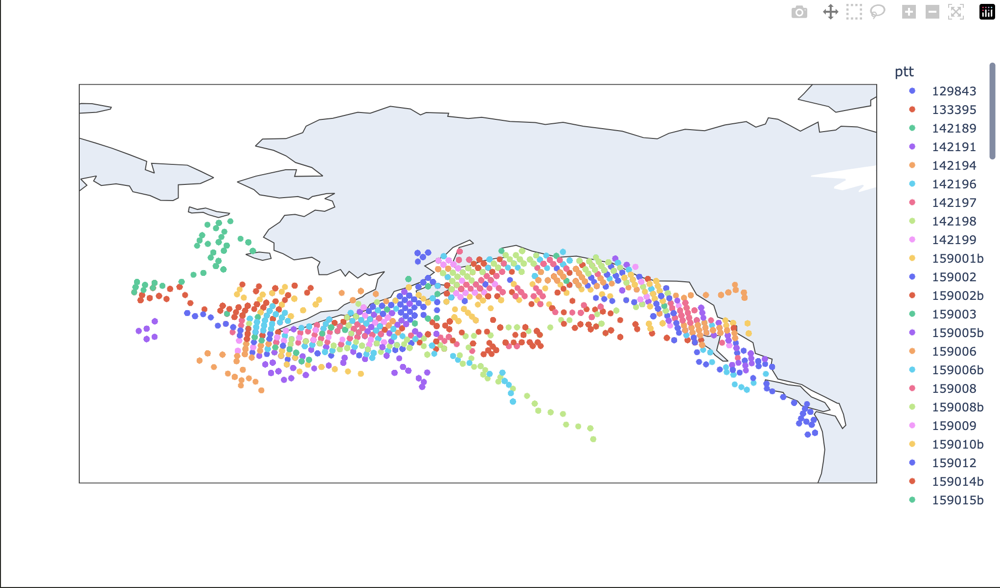
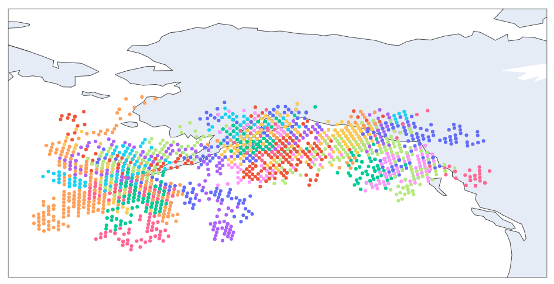

# March 15, 2024

## Building an IBM - a strategy

Very broadly, life can be distilled into two things - choices made and the consequences of those choices. An IBM then, is an attempt to model each of these. 

Let's start with choice. The knee-jerk reaction to "modeling choice" would probably be to try and predict the choice a creature would make given some current state. But I'd wager this isn't what we want because usually we don't know enough to predict *the* choice a creature would make. Indeed, even assuming there is a deterministic input to output mapping under full knowledge is a very strong assumption - randomness abounds in all kinds of decision making. 

Therefore what I'd say is that it doesn't matter so much precisely *what* decision was made but rather what the relative likelihoods amongst several options are. I don't need to predict exactly what you're going to eat for lunch, I just want to know the relative odds given the options. If I know that I'll be able to simulate someone with very similar eating habits to yourself. 

As such we'll introduce the notion of "utility" of an option as being a value that, when normalized given all the options available, corresponds to the probability that you'd pick that option. If we can predict this utility, I'd wager we can incorporate both what we know and what we don't in the behavior of a creature we're trying to model. 

This then leaves us with three ingredients when it comes to modeling choice:

1. A function that gives us the set of options given the state of the creature
2. A decision on what aspects of state we think are relevant to computing the "utility" of those options
3. A model that predicts the utility given those aspects of state

However, from a computational perspective, the full gamut of options will be altogether far too large. For example consider the decisions available to you at the start of a day. Do you watch the news or eat some breakfast? If breakfast will you make a meal or eat some leftovers or go get something from a breakfast place? If from a breakfast place which one? What will you order from their menu? And so on. The combinatorics get painful fast from a combinatorial perspective.

We can deal with this by creating a hierarchy of decisions. Basically instead of considering all of the combinations of options outlined above, we take each decision at a time. Watch the news or get breakfast? Given breakfast, eat at home or out? Given out... you get the idea. Each of these individual choices has a clear set of options that are far more manageable. Furthermore this allows the model to be build in parts because each aspect of the hierarchy becomes its own independent "decision module" within a decision tree or network. 

But what about decisions that lie on a continuum? For example which direction I decide to walk in or precisely when I want to wake up? Such precision is, in my view, unnecessary. Take your continuum and discretize it. It will make computation far easier and lead to better models as well (as you won't be dealing with quite as sparse a problem).

With all this in mind then, the proposal is as such. Modeling choice is as simple as building a decision tree composed of a hierarchy of decision nodes composed of (1) a choice generator, (2) a relevant feature extractor, and (3) a utility model. Then each node takes the state of the creature, any new state from the decision nodes above it, generates the options, builds features for each option, predicts utility, chooses an option given the normalized utility, updates the state of the creature, and triggers any subsequent nodes in the tree given its decision.

Then the second part of our IBM - the consequences - would come into play. But this just becomes an environmental simulation/model at that point. And what we want to model here is really an outcome of (1) what we need to model to run our decision tree and (2) what we want to get out of the IBM as a whole. So in many ways, the decision tree comes first - understand that and you're 90% of the way to understanding what your whole IBM looks like. 

What's lovely about this approach is three things. First, as we already mentioned, once you have your tree sorted out, each node in the tree can be handled independently. This means both that carving out the work into individual pieces becomes immediately apparent but also that several people can work on building these models at once. And if there is a bit where data/understanding is missing you can always just plug in a random choice generator and focus on building out the pieces you do understand in order to see how important it is to model the component you don't have as good a grasp on. In short the work becomes very usefully divisible. 

The second lovely aspect is that this approach deals with one of the big criticisms of IBMs - that every single one is one of a kind and largely unrepeatable. The strategy that we've outlined here obviously applies to any behavior you want to model. Whether you're modeling trout or birds or trees you could create a decision tree like this and the strategy for doing so would be the same every single time. What's unique is the specific state you're going to capture and the exact kinds of choices you're going to allow. But these obviously have to be unique to the species in question. We've managed to pull the specifics out of the process so that we can build individualized models with a repeatable, generalized process.

Finally the last lovely aspect deals with another IBM criticism - obscurity. Once again, because we're building an explicit tree, the models form is also as explicit. No more wondering how things connect and what's going on - those decision have to be made upfront and are absolutely clear from the code. Which means you could pretty easily but together an auto-documenter. 

### Looking Broader

Posed as a decision tree I think the value of an IBM becomes rather obvious. They become consolidated repositories of understanding. Rather than having your creature science distributed across a whole load of papers and individual models answering individual questions you can instead slot each piece of new understanding somewhere into this tree. And then, folks can use the part of the tree they need. 

So, for example, if we're wanting to build a spatio-temporal model of a specific species of salmon and someone learns something new about how juvenile salmon migrate, you just slot it into the tree, publish the new version, and whoever was using the IBM before to do spatial modeling just receives the updates from that person's study. 

Given I ultimately want to take creature science and help connect it to management, this potential outcome of IBMs feels pretty attractive. 

Finally I think it's worth pointing out that even if you built an IBM with all the knowledge you could find only to find the IBM sucks that's still a good outcome, because you've effectively built a model that predicts behavior *given what you know* and therefore allows you to compare what really happens to what you are capable to modeling. This then would provide a spring board for understanding what's left to be understood and subsequently prioritizing efforts to unravel those unknowns. In other words the errors in an IBM become sign posts for new research. 

All in all then I'm pretty convinced building one of these is what I want my project to be over the next couple 'o years. 

## Back to Chinook

Here then is my proposal for a Chinook decision tree (and one update I want to make next week is to have a diagram like this auto-generated from my code):

Now I've gone ahead and built out a version of this given the data I have at present (more on that later). But there are two very clear things I need to actually do this right given the reading I've been doing.

1. The age of the fish
2. The cohort it's from

So here's a question - how would I best go about estimating age? (do I just use the inverse of a growth model?) and is there a way to get cohort? (I remember someone mentioning genetics at some point)

### The Model Itself

Alright so at this point I have a very basic model - [code](https://github.com/networkearth/mirrorverse/blob/main/mirrorverse/chinook/tree.py) - that totally ignores the migrate home piece and the juvenile vs "sub adult" behavior piece. 

It also has extremely basic information - bathymetry and average surface temps per month from one random year I pulled down. I've trained it with the data that Michael was kind enough to share with me and this is more or less what the result looks like:

Actuals:

Simulated:

Total Random Choices

So even with the model being half baked and using pretty basic (and honestly questionable) data it's doing a reasonably good job (especially when you compare against random guessing).

However I really do think the next steps are to add some sense of cohort and age and then add in the two extra nodes in the decision tree.

## Moving Forward

Now that I've got a clearer idea of where I'm going and the tasks are really starting to stack up I'm going to start tracking all of this in git issues: [kanban board](https://github.com/orgs/networkearth/projects/1/views/1)

